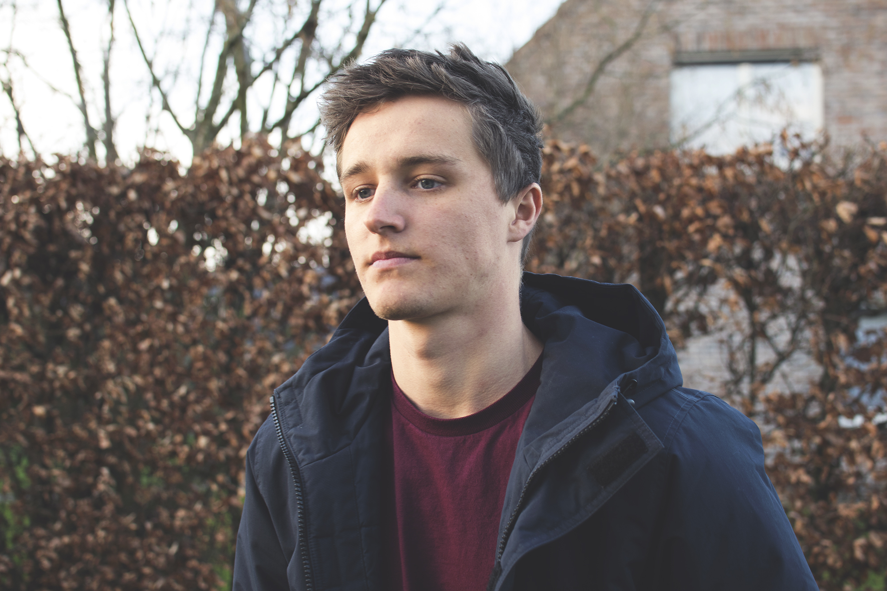

#Resume
--------
## Personalia

|                      |                                                 |
| -------------------- | ----------------------------------------------- |
| Naam                 | Ian Vleeshouwers                                | 
| Adres & woonplaats   | Waterdijkstraat 14 9961 Boekhoute               |  
| Geboortedatum        | 15/04/1997                                      | 
| Geslacht             | Man                                             | 
| Nationaliteit        | Belg                                            | 
| Burgerlijke staat    | Ongehuwd                                        |
| Telefoonnummer       | 0472064784                                      |
| E-mailadres          | Ianvleeshouwers@hotmail.com                     |
| Website              | [Ianvleeshouwers.be](http://ianvleeshouwers.be/)|

sociale media:

[facebook](https://www.facebook.com/ian.vleeshouwers)
[soundcloud](https://soundcloud.com/secret-culture)

## Opleidingen
* ASO Wetenschappen College O.-L.-V. Ten Doorn  
* TSO Multimedia Viso Mariakerke  
* Bachelor in Multimediaproductie proDEV  

## Werkervaring
* 2014 Garçon Cafe-Restaurant Curieus  
* 2015 Logistiek DOW Terneuzen  
* 2016 Logistiek IKEA Gent  
* Webdesign/Branding klanten  

## Cursussen Workshops
* VCA

## Computerkennis  
|                                 |                                                                                           |
| --------------------            | ----------------------------------------------------------------------------------------- |
| Software                        | Adobe CC (Photoshop, Illustartor, Indesign, After Effects, Premiere), Office(Word, Excel) |
| Webtechnologie                  | HTML5, CSS3, Javascript, PHP                                                              |
| Favoriete websites & apss       | [Awwwards](http://www.awwwards.com/), [siteUP](https://site.uplabs.com/)                  |

## Talenkennis 
|                      |      |
| -------------------- | ---- |
| Nederlands           | 100% | 
| Engels               | 62%  |
| Frans                | 31%  |

## Overige 
* Fitness

